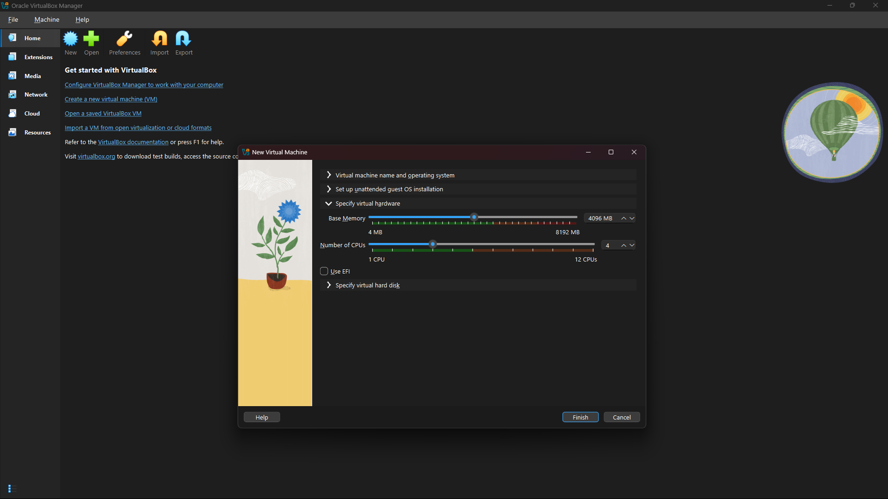
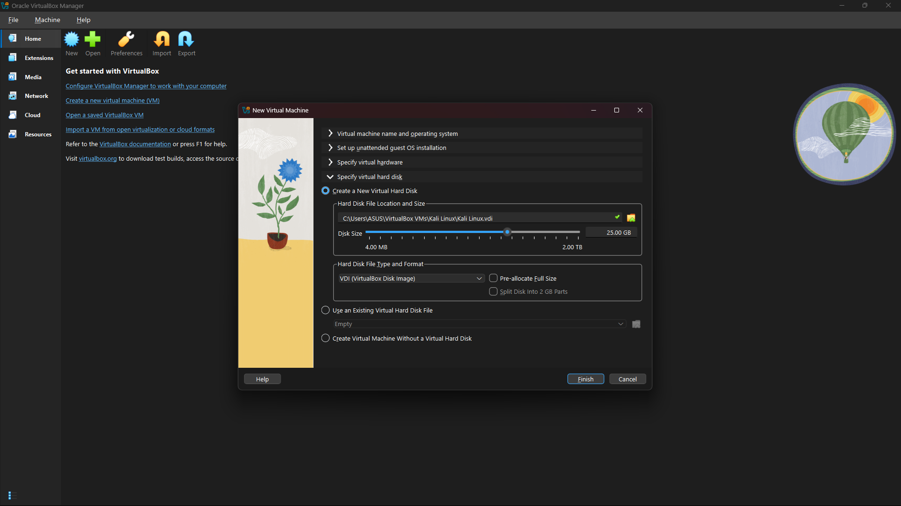
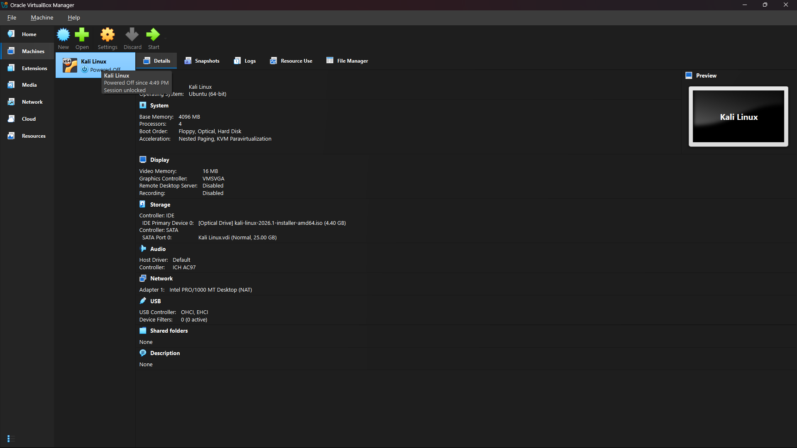
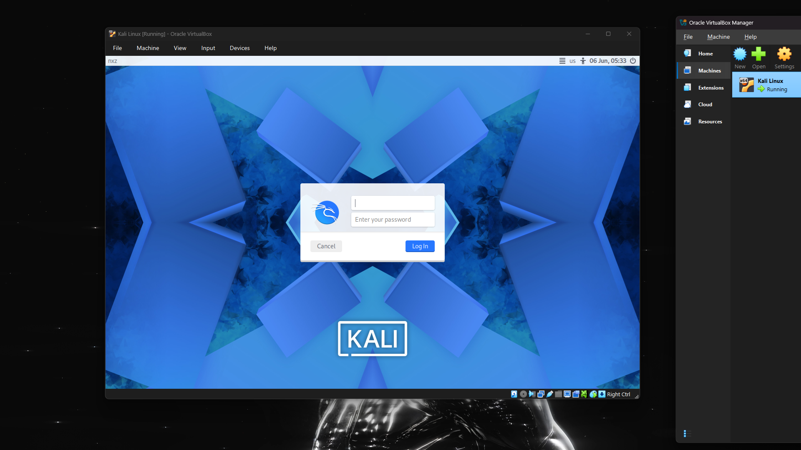
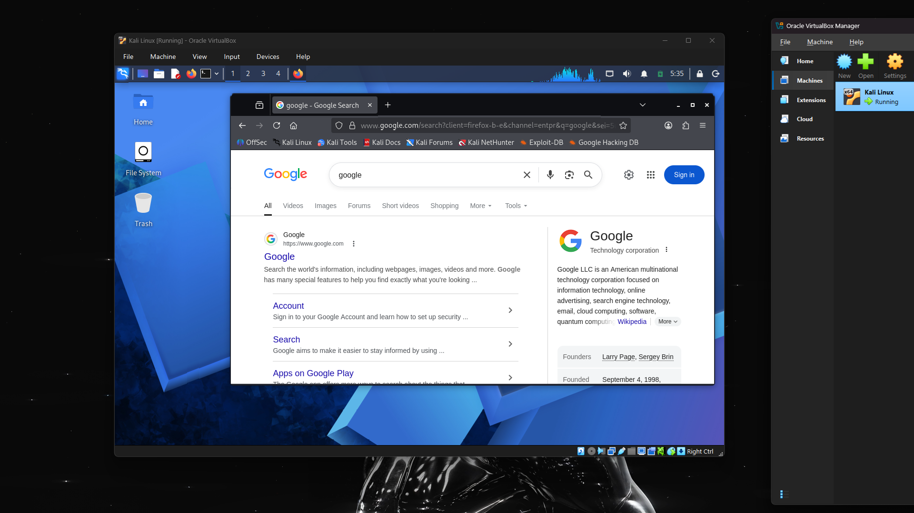

# Lab Report: Type 2 Hypervisor Deployment and Guest OS Installation
A hands-on virtualization project aligned with CompTIA A+ Core 1 objectives.

## Objective
To develop practical experience in deploying and managing a guest operating system within a hosted Type 2 hypervisor environment. This lab demonstrates the installation, configuration, and validation of a Linux-based virtual machine using Oracle VM VirtualBox.

## Technical Specifications
* **Hypervisor:** Oracle VM VirtualBox
* **Guest OS:** Kali Linux (Debian 64-bit)
* **Resource Allocations:** 4 CPU Cores | 4 GB RAM | 25 GB Dynamic Storage

---

## Configuration & Deployment Log

### 1. Virtual Hardware Configuration
Allocated virtual hardware resources, including processor cores and system memory, to provide the guest operating system with sufficient computing capacity while maintaining host system performance.

### 2. Virtual Storage Provisioning
Created a dynamically allocated virtual hard disk to serve as the primary storage device for the guest operating system. Dynamic allocation allows storage consumption to grow as needed while conserving host disk space.

### 3. Virtual Machine Registration
Successfully created and registered the Kali Linux virtual machine within the VirtualBox management interface. The virtual machine was recognized by the hypervisor and prepared for operating system installation.

### 4. Operating System Installation and Authentication
Completed the Kali Linux installation process and successfully booted into the operating system login interface. This confirmed proper installation of the guest operating system and successful hardware initialization.

### 5. Desktop Environment and Network Connectivity Validation
Loaded the Kali Linux desktop environment and launched the Firefox web browser. Accessed Google successfully to verify that the virtual machine had internet connectivity through the configured NAT network adapter.

## Results
The deployment was completed successfully. The Kali Linux guest operating system was installed and configured within Oracle VM VirtualBox, demonstrating the functionality of a hosted Type 2 hypervisor. Resource allocation, storage provisioning, operating system installation, user authentication, and internet connectivity were all verified without issues.